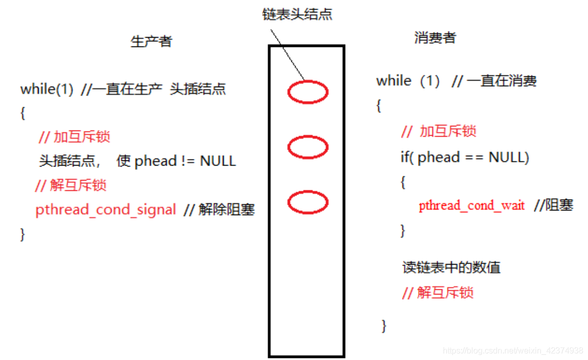
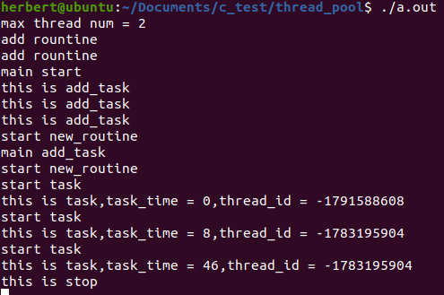
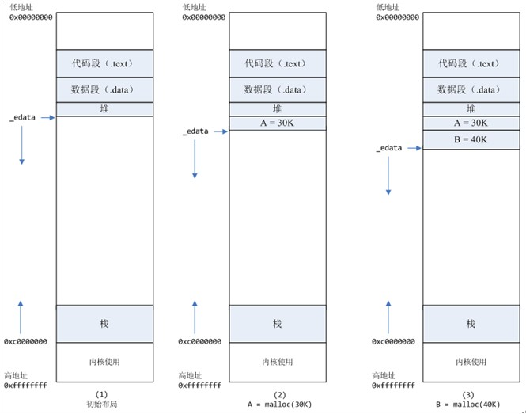

[TOC]

#### 一.pthread

##### 1.互斥锁

###### 1).创建

a.静态

```c++
pthread_mutex_t mutex = PTHREAD_MUTEX_INITIALIZER;
```

b.动态

使用**pthread_mutex_init()初始化**

```c++
int pthread_mutex_init(pthread_mutex_t *mutex, const pthread_mutexattr_t *mutexattr);//mutexattr用于指定互斥锁属性，如果为NULL则使用缺省属性。

/*
PTHREAD_MUTEX_TIMED_NP，这是缺省值，也就是普通锁。当一个线程加锁以后，其余请求锁的线程将形成一个等待队列，并在解锁后按优先级获得锁。这种锁策略保证了资源分配的公平性； PTHREAD_MUTEX_RECURSIVE_NP，嵌套锁，允许同一个线程对同一个锁成功获得多次，并通过多次unlock解锁。如果是不同线程请求，则在加锁线程解锁时重新竞争；
PTHREAD_MUTEX_ERRORCHECK_NP，检错锁，如果同一个线程请求同一个锁，则返回EDEADLK，否则与 
PTHREAD_MUTEX_TIMED_NP类型动作相同。这样就保证当不允许多次加锁时不会出现最简单情况下的死锁。
*/
```

###### 2).销毁

```c++
int pthread_mutex_destroy(pthread_mutex_t *mutex);
```

###### 3).锁操作

```c++
int pthread_mutex_lock(pthread_mutex_t *mutex);
int pthread_mutex_unlock(pthread_mutex_t *mutex);
int pthread_mutex_trylock(pthread_mutex_t *mutex);
```

##### 2.条件变量

###### 1).创建

a.静态：

```c++
pthread_cond_t cond=PTHREAD_COND_INITIALIZER;
```

b.动态：

调用**pthread_cond_init()**函数

```c++
int pthread_cond_init(pthread_cond_t *cond, pthread_condattr_t *cond_attr);
```

###### 2).注销

```c++
int pthread_cond_destroy(pthread_cond_t *cond);
```

ps：在没有线程在该条件变量上等待的时候才能注销这个条件变量，否则返回EBUSY

###### 3).等待条件

```c++
int pthread_cond_wait(pthread_cond_t *cond, pthread_mutex_t *mutex);
int pthread_cond_timedwait(pthread_cond_t *cond, pthread_mutex_t *mutex, 
                           const struct timespec *abstime);
/*计时等待方式如果在给定时刻前条件没有满足，则返回ETIMEOUT并结束等待。
abstime以与time()系统调用相同意义的绝对时间形式出现，0表示格林尼治时间1970年1月1日0时0分0秒。*/
/*
无论哪种等待方式，都必须和一个互斥锁配合，以防止多个线程同时请求pthread_cond_wait() 或pthread_cond_timedwait() 的竞争条件。在调用pthread_cond_wait()前必须由本线程加锁（pthread_mutex_lock()），而在更新条件等待队列以前，mutex保持锁定状态，并在线程挂起进入等待前自动解锁。在条件满足从而离开pthread_cond_wait()之前，自动重新加锁，以与进入pthread_cond_wait()前的加锁动作对应。
*/
```

###### 4).执行步骤

线程加锁->更新条件等待队列->解锁（自动）->线程挂起（wait等待）->自动重新加锁（在满足条件离开pthread_cond_wait之前）->线程解锁退出


###### 5).激发条件

```c++
//激活所有等待线程
int pthread_cond_broadcast(pthread_cond_t *cond);
//激活一个等待该条件的线程，存在多个等待线程时按入队顺序激活其中一个
int pthread_cond_signal(pthread_cond_t *cond);
```




参考：[条件变量](https://blog.csdn.net/weixin_42374938/article/details/119208570?spm=1001.2101.3001.6650.1&utm_medium=distribute.pc_relevant.none-task-blog-2~default~CTRLIST~default-1.pc_relevant_paycolumn_v2&depth_1-utm_source=distribute.pc_relevant.none-task-blog-2~default~CTRLIST~default-1.pc_relevant_paycolumn_v2&utm_relevant_index=2)

扩展：[linux C++ 多线程使用pthread_cond 条件变量](https://www.cnblogs.com/xudong-bupt/p/6707070.html)

###### 6).线程取消

```c++
//发送终止信号给thread线程,如果成功则返回0
int pthread_cancel(pthread_t thread)；
//设置本线程对Cancel信号的反应
int pthread_setcancelstate(int state, int *oldstate)；
//设置本线程取消动作的执行时机
int pthread_setcanceltype(int type, int *oldtype)；
//检查本线程是否处于Cancel状态，如果是，则进行取消动作，否则直接返回
void pthread_testcancel(void)；
```

Cancelation-point（取消点）：
根据POSIX标准，**pthread_join()**、**pthread_testcancel()**、**pthread_cond_wait()**、**pthread_cond_timedwait()**、**sem_wait()**、**sigwait()**等函数以及**read()**、**write()**等会引起阻塞的系统调用都是**Cancelation-point**，而其他pthread函数都不会引起Cancelation动作。

[线程取消学习参考](https://www.cnblogs.com/lijunamneg/archive/2013/01/25/2877211.html)

> 线程终止，终止时清理及同步

参考资料：[Pthread使用总结](https://blog.csdn.net/liujiabin076/article/details/53456962)


多线程参考字典：

英文版：[POSIX Threads Programming](https://hpc-tutorials.llnl.gov/posix/#Abstract)

中文版：[POSIX 多线程程序设计](https://blog.csdn.net/future_fighter/article/details/3865071#pthreads_overview)

pthread_create()和pthread_join()相关补充

[多线程之pthread_create()函数](https://blog.csdn.net/wushuomin/article/details/80051295)

分析死锁情况：

1.一个线程试图对一个互斥量加锁两次

2.两个线程交叉持锁

参考：[pthread_mutex_t死锁](https://blog.csdn.net/u010144805/article/details/78438992?spm=1001.2101.3001.6650.1&utm_medium=distribute.pc_relevant.none-task-blog-2~default~CTRLIST~default-1.no_search_link&depth_1-utm_source=distribute.pc_relevant.none-task-blog-2~default~CTRLIST~default-1.no_search_link&utm_relevant_index=2)

```c++
//加锁
pthread_mutex_lock
//解锁
pthread_mutex_unlock
//等待
pthread_cond_wait
//固定时间等待
pthread_cond_timewait
//唤醒一个睡眠线程
pthread_cond_signal
//唤醒所有睡眠线程
pthread_cond_broadcast
//释放
pthread_mutex_destroy
pthread_cond_destroy
//显式退出线程
pthread_exit
//https://blog.csdn.net/zhou1021jian/article/details/71531699
```

读写锁

[C++11读写锁的实现](https://blog.csdn.net/weixin_41666796/article/details/105016908)

#### 二.thread

参考资料：

[std::this_thread 命名空间](https://blog.csdn.net/luoshabugui/article/details/86588578)

[this_thread::sleep_for（线程睡眠）](https://zhuanlan.zhihu.com/p/260725455)

[condition_variable（条件变量）](https://zhuanlan.zhihu.com/p/260052050)

[生产者消费者模型](https://zhuanlan.zhihu.com/p/259541449)

[thread_local（线程储存期说明符）](https://murphypei.github.io/blog/2020/02/thread-local)

##### 1.std::thread

std::thread是c++支持的线程类，是linux上对pthread的一层包装

示例:

```c++
//test6.cpp
#include <iostream>
#include <mutex>
#include <thread>
#include <chrono>
using namespace std;
mutex m_lock;
void func(const char* tname)
{
        this_thread::sleep_for(chrono::milliseconds(100));
        lock_guard<mutex> guard(m_lock);//gusrd锁
        cout<<"I am thread "<<tname<<endl;
}
int main()
{
        thread t1(func, "A");
        thread t2(func, "B");
        //t1.detach();
        //t2.detach();
        t2.join();
        t1.join();
}
//g++ test6.cpp -o a.out -pthread -std=c++11
```

包含：1.线程锁（mutex）2.条件变量（[condition_variable](https://www.jianshu.com/p/a31d4fb5594f)）

##### 2.std::condition_variable 类

###### 1）wait()

函数原型：

```c++
//当前线程的执行会被阻塞，直到收到notify为止。
wait(unique_lock <mutex>&lck);
//当pred为false时调用才会阻塞，并且当收到notify时只有pred为true才会解除阻塞
wait(unique_lock <mutex>&lck，Predicate pred);
```

###### 2）wait_for()

函数原型：

```c++
/*
同wait()，有两个原型，不同点是：rel_time参数可以指定一个时间段，在当前线程收到通知或者指定的时间超时之前，该线程都会处于阻塞状态。而一旦超时或者收到了其他线程的通知，wait_for返回
*/
wait_for (unique_lock<mutex>& lck,
      const chrono::duration<Rep,Period>& rel_time);
wait_for (unique_lock<mutex>& lck,
                      const chrono::duration<Rep,Period>& rel_time, Predicate pred);
```

###### 3）wait_until()

用法与1)，2)类似

###### 4）notify_one()

唤醒某个不确定的等待(wait)中的线程，如果没有，什么都不做。

###### 5）notify_all()

唤醒所有等待(wait)中的线程，如果没有，什么都不做。

##### 3.std::condition_variable_any

`std::condition_variable`只接受`unique_lock <mutex>`参数 ，`std::condition_variable_any`可以接受任何 `lockable` 参数

参考文章：

[C++11 并发编程系列(三)：条件变量(condition_variable)](https://murphypei.github.io/blog/2019/04/cpp-concurrent-3.html)

[C++11 条件变量（condition_variable） 使用详解](https://www.cnblogs.com/xiaohaigegede/p/14008121.html)

[C++11条件变量使用详解](https://blog.csdn.net/c_base_jin/article/details/89741247)


扩展:储存期

参考：[储存类说明符](https://zh.cppreference.com/w/cpp/language/storage_duration)

> 程序中的所有[对象](https://zh.cppreference.com/w/cpp/language/object)都具有下列存储期之一：
>
> ***自动（automatic）***存储期。这类对象的存储在外围代码块开始时分配，并在结束时解分配。未声明为 `static`、`extern` 或 `thread_local` 的所有局部对象均拥有此存储期。
>
> ***静态（static）***存储期。这类对象的存储在程序开始时分配，并在程序结束时解分配。这类对象只存在一个实例。所有声明于命名空间（包含全局命名空间）作用域的对象，加上声明带有 `static` 或 `extern` 的对象均拥有此存储期。有关拥有此存储期的对象的初始化的细节，见[非局部变量](https://zh.cppreference.com/w/cpp/language/initialization#.E9.9D.9E.E5.B1.80.E9.83.A8.E5.8F.98.E9.87.8F)与[静态局部变量](https://zh.cppreference.com/w/cpp/language/storage_duration#.E9.9D.99.E6.80.81.E5.B1.80.E9.83.A8.E5.8F.98.E9.87.8F)。
>
> ***线程（thread）***存储期。这类对象的存储在线程开始时分配，并在线程结束时解分配。每个线程拥有其自身的对象实例。只有声明为 `thread_local` 的对象拥有此存储期。 `thread_local` 能与 `static` 或 `extern` 一同出现，它们用于调整链接。关于具有此存储期的对象的初始化的细节，见[非局部变量](https://zh.cppreference.com/w/cpp/language/initialization#.E9.9D.9E.E5.B1.80.E9.83.A8.E5.8F.98.E9.87.8F)和[静态局部变量](https://zh.cppreference.com/w/cpp/language/storage_duration#.E9.9D.99.E6.80.81.E5.B1.80.E9.83.A8.E5.8F.98.E9.87.8F)。
>
> ***动态（dynamic）***存储期。这类对象的存储是通过使用[动态内存分配](https://zh.cppreference.com/w/cpp/memory)函数来按请求进行分配和解分配的。关于具有此存储期的对象的初始化的细节，见 [new 表达式](https://zh.cppreference.com/w/cpp/language/new)。

#### 三.区别与联系

[从 pthread 转换到 std::thread](https://blog.csdn.net/qq_41570835/article/details/112970270?utm_medium=distribute.pc_aggpage_search_result.none-task-blog-2~aggregatepage~first_rank_ecpm_v1~rank_v31_ecpm-1-112970270.pc_agg_new_rank&utm_term=pthread+thread%E5%8C%BA%E5%88%AB&spm=1000.2123.3001.4430)


#### 四.简单线程池

https://www.cnblogs.com/yangang92/p/5485868.html

https://blog.csdn.net/zdarks/article/details/46994607


https://zhuanlan.zhihu.com/p/88896082

完整线程池

https://blog.csdn.net/qq_36359022/article/details/78796784

用对象管理资源例

https://www.cnblogs.com/xudong-bupt/p/6736783.html


[基于pthread的线程池实现](https://www.cnblogs.com/gaoyun/p/5295660.html)

生产者消费者

[C++知识点-线程6-notify_one](https://blog.csdn.net/wisdomfriend/article/details/107349450?utm_medium=distribute.pc_relevant.none-task-blog-2~default~baidujs_baidulandingword~default-1.no_search_link&spm=1001.2101.3001.4242.2&utm_relevant_index=4)


第一版：简易线程池

实现内容：

1.互斥量，条件变量，任务队列，线程数组，固定类型（void（））任务函数

2.pthread实现

效果：手动添加任务执行

```c++
#include <iostream>
#include <pthread.h>
#include <functional>
#include <queue>
#include <unistd.h>
using namespace std;
using Task = function<void()>;
queue<Task> tasks;

pthread_mutex_t mutex;
pthread_cond_t cond;
int init()
{
	printf("this is init\n");
	int status;
	if(status = pthread_mutex_init(&mutex, NULL))
		return status;
	if(status = pthread_cond_init(&cond, NULL))
		return status;
	return 0;
}
void print()
{
	printf("this is task\n");
}

void* routine(void*)
{
	printf("this is routine\n");
	while(1)
	{
		pthread_mutex_lock(&mutex);
		while(tasks.empty())
		{
			pthread_cond_wait(&cond, &mutex);
		}
		auto task = tasks.front();
		tasks.pop();
		pthread_mutex_unlock(&mutex);
		
		printf("start task\n");
		task();
	}
}
int add_task()
{
	printf("this is add_task\n");
	pthread_mutex_lock(&mutex);
	tasks.emplace(print);
	pthread_cond_signal(&cond);
	pthread_mutex_unlock(&mutex);
}
int destory(pthread_t* tid)
{
	for(int i = 0;i < 5;i++)
        {
                pthread_join(tid[i], NULL);
        }
	pthread_mutex_destroy(&mutex);
	pthread_cond_destroy(&cond);
	
}
int main()
{
	if(init() != 0) return -1;
	pthread_t *tid = new pthread_t[5];
	for(int i = 0;i < 5;i++)
	{
		pthread_create(&tid[i], NULL, &routine, NULL);
	}
	usleep(100);
	add_task();
	add_task();
	add_task();
	add_task();
	add_task();
	add_task();
	/*for(int i = 0;i < 5;i++)
        {
                pthread_join(tid[i], NULL);
        }*/
	destory(tid);

	printf("end main\n");

}
```

第二版：简易线程池

实现内容：

1.互斥量，条件变量，任务队列，线程数组，固定类型（void（））任务函数

2.使用c++11中thread实现

效果：手动添加任务执行

```c++
#include <iostream>
#include <functional>
#include <queue>
#include <unistd.h>

#include <thread>
#include <mutex>
#include <condition_variable>
using namespace std;
using Task = function<void()>;
queue<Task> tasks;

std::mutex m_lock;
condition_variable cv;
unique_lock<std::mutex> lk(m_lock);

void print()
{
	printf("this is task\n");
}

void new_routine()
{
    printf("start new_routine\n");

    while (1)
    {
        while(tasks.empty())
        {
            cv.wait(lk);
        }
        auto task = tasks.front();
        tasks.pop();
		printf("start task\n");
        task();
    }
}

void new_add_task()
{
	printf("this is add_task\n");
    tasks.emplace(print);
    cv.notify_one();
}

int main()
{
    thread t[2];
    for (int i = 1; i <= 2; i++)
    {
        t[i] = thread(&new_routine);
    }

   	usleep(100);
    new_add_task();
    new_add_task();
    new_add_task();
    new_add_task();
    for (int i = 1; i <= 2; i++)
    {
        if (t[i].joinable())
        {
            t[i].join();
        }
        // t[i].detach();
    }
	printf("end main\n");
    
}
```

第三版：简易线程池

用类封装

```c++
#include <iostream>
#include <mutex>
#include <condition_variable>
#include <functional>
#include <queue>
#include <unistd.h>
#include <thread>
#include <vector>
#include <ctime>
using namespace std;
#define MAX_THREAD_NUM thread::hardware_concurrency();
using Task = function<void()>;

void print(int time)
{
	printf("this is task,task_time = %d,thread_id = %d\n", time, this_thread::get_id());
    usleep(time);
}
class thread_pool
{
public:
    int max;
    bool done;
    queue<Task> tasks;
    vector<thread> threads;
    std::mutex m_lock;
    std::condition_variable cv;
public:
    thread_pool();
    ~thread_pool();
    void start();
    void stop();
    void add_task(Task task);
    void rountine();
};

void thread_pool::start()
{
    // thread t[max];
    for (int i = 0; i < max; i++)
    {
    	printf("add rountine\n");
        threads.emplace_back(thread(&thread_pool::rountine, this));
    }
}
void thread_pool::stop()
{
    unique_lock<std::mutex> lk(m_lock);
    printf("this is stop\n");
    cv.notify_all();
    for (int i = 0; i < max; i++)
    {
        threads[i].join();
    }
    
    printf("after join\n");

}
void thread_pool::add_task(Task task)
{
    unique_lock<std::mutex> lk(m_lock);
    printf("this is add_task\n");
    tasks.emplace(task);
    cv.notify_one();
}
void thread_pool::rountine()
{
    printf("start new_routine\n");   
    while (1)
    {
        unique_lock<std::mutex> lk(m_lock);
        if(tasks.empty())
        {
            cv.wait(lk);
        }
        else
        {
            auto task = tasks.front();
            tasks.pop();
		    printf("start task\n");
            task();
        }
        
    }
}

thread_pool::thread_pool(/* args */)
{
    max = MAX_THREAD_NUM;
    done = false;
    printf("max thread num = %d\n", max);
    start();
}

thread_pool::~thread_pool()
{
    if (done)
    {
        stop();
    }
}

int main()
{
    thread_pool pool;
	printf("main start\n");
    srand((int)time(0));
    for (int i = 0; i < 3; i++)
    {
        int time = rand()%100;
        Task t = bind(print, time);
        pool.add_task(t);
    }
	printf("main add_task\n");
    usleep(100);
    pool.stop();
	printf("main stop\n");
    usleep(100);
}
```

踩坑：

1.thread传入类成员函数用法：

```c++
thread t(mclass::mfunc, this);
```

参考：[C++11 std::thread在类的成员函数中的使用](https://www.cnblogs.com/mathyk/p/12058028.html)

2.thread可转移但不能复制

3.使用unique_lock加锁方式：其中m_lock为定义好的mutex

```c++
unique_lock<std::mutex> lk(m_lock);
```

优化参考：[基于C++11 thread实现线程池](https://blog.csdn.net/venice0708/article/details/82760879)

参考：[c/c++ 多线程 unique_lock的使用](https://www.cnblogs.com/xiaoshiwang/p/9912004.html)

运行结果:



#### 五.补充

c++11中thread线程补充内容：[C++11多线程：thread头文件](https://blog.csdn.net/u014673282/article/details/89209405)

#### 六.Sleep(0)

##### 1.Sleep函数作用

​		Sleep函数的作用是告诉操作系统“在未来的多少毫秒内我不参与CPU竞争“。并不是说结束该段时间后立刻就能获得CPU，还是需要通过竞争得到CPU使用权。
​		Sleep(0)的作用就是”触发操作系统立刻重新进行一次CPU竞争“

##### 2.线程状态与Sleep

​		线程未退出之前有三种状态，**就绪态**，**运行态**，**等待态**。而Sleep(n)之后，线程就会由运行态转入等待态，线程被放入等待队列中，当达到n秒后线程才重新由等待态转入就绪态，被放入就绪队列中。
​		等待队列中的线程不参与CPU竞争，只有就绪队列中的线程才参与，而**CPU调度**，就是根据一定算法（优先级、FIFO等），从就绪队列中选择一个线程来分配CPU时间。
​		sleep(0)会直接回到就绪队列参与CPU竞争，而不是进入等待队列中。

##### 3.使用

> ​		假如AB两个线程为合作关系，A线程处理一些原始数据，数据处理到一定程度，交给B线程处理，在A处理原始数据的时候，B也要做一些准备工作，所以，AB是并发的，但是B做好准备之后，需要等待A处理好那些数据，接过A的数据，继续处理.

> ​		如果A不使用信号或者等待条件来通知B的话，那么B必须一直轮询，查看A是否已完成，B线程所做的这个轮询是否会一直占用CPU来做无用的循环查看呢？

> ​		因此，这里sleep(0)就有作用，当B查看A没处理完数据的时候，B马上sleep(0)交出B的时间片，让操作系统调度A来运行(假设只有AB两个线程），那么这个时候，A就会得到充分的时间来处理它的数据

参考：[Sleep(0)的妙用](https://blog.csdn.net/qiaoquan3/article/details/56281092/)

#### 七.锁

##### 1.使用

> ​		只有在并发环境中，共享资源不支持并发访问，或者说并发访问共享资源会导致系统错误的情况下，才需要使用锁。

##### 2.问题

1)使用完锁一定要释放，否则就会造成死锁。

> 比较容易出现状况的地方是，很多语言都有异常机制，当抛出异常的时候，不再执行后面的代码。如果在访问共享资源时抛出异常，那后面释放锁的代码就不会被执行，这样，锁就一直无法释放，形成死锁。所以，你要考虑到代码可能走到的所有正常和异常的分支，确保所有情况下，锁都能被释放。

有些语言提供了 try-with 的机制，不需要显式地获取和释放锁，可以简化编程，有效避免这种问题，推荐你使用。

比如在 Python 中：

```python
lock = threading.RLock()

def visitShareResWithLock():
  with lock:
    # 注意缩进
    # 在这里安全的访问共享资源
  
  # 锁会在with代码段执行完成后自动释放
```

2)两个线程分别持一把锁，并且都在等待对方的锁释放，就会造成死锁。

> 避免在持有一把锁的情况下去获取另一把锁。

##### 3.如何避免死锁

> 1.再次强调一下，避免滥用锁，程序里用的锁少，写出死锁 Bug 的几率自然就低。
> 2.对于同一把锁，加锁和解锁必须要放在同一个方法中，这样一次加锁对应一次解锁，代码清晰简单，便于分析问题。
> 3.尽量避免在持有一把锁的情况下，去获取另外一把锁，就是要尽量避免同时持有多把锁。
> 4.如果需要持有多把锁，一定要注意加解锁的顺序，解锁的顺序要和加锁顺序相反。比如，获取三把锁的顺序是 A、B、C，释放锁的顺序必须是 C、B、A。
> 5.给你程序中所有的锁排一个顺序，在所有需要加锁的地方，按照同样的顺序加解锁。比如我刚刚举的那个例子，如果两个线程都按照先获取 lockA 再获取 lockB 的顺序加锁，就不会产生死锁。

#### 八.多线程中堆栈问题

1.多线程环境堆栈分配情况

1）每个线程一个栈，每个进程一个堆。

2）不同的段可能被加载器映射到相距很遥远的位置。如下典型内存分配图



扩展：	

> 1.变量在内存地址的分布为：堆-栈-代码区-全局静态-常量数据
> 2.同一区域的各变量按声明的顺序在内存的中依次由低到高分配空间（只有未赋值的全局变量是个例外）。
> 3.全局变量和静态变量如果不赋值，默认为0。 栈中的变量如果不赋值，则是一个随机的数据。
> 4.编译器会认为全局变量和静态变量是等同的，已初始化的全局变量和静态变量分配在一起，未初始化的全局变量和静态变量分配在另一起。

参考：

[【C/C++笔记】之多线程中的堆栈问题](https://blog.csdn.net/qq_35097289/article/details/88865560)

[C/C++变量在内存中的分布](https://blog.csdn.net/morewindows/article/details/6851681)

#### 九.c++ 互斥量(mutex)

##### 1.各个版本c++中的互斥量(mutex)

| 互斥量                | 版本      | 作用                       |
| --------------------- | --------- | -------------------------- |
| mutex                 | C++11     | 最基本的互斥量             |
| timed_mutex           | C++11     | 有超时机制的互斥量         |
| recursive_mutex       | C++11     | 可重入的互斥量             |
| recursive_timed_mutex | C++11     | 结合 2,3 特点的互斥量      |
| shared_timed_mutex    | **C++14** | 具有超时机制的可共享互斥量 |
| shared_mutex          | **C++17** | 共享的互斥量               |

##### 2.互斥量(mutex)操作

> **mutex**的中文翻译就是互斥量，很多人喜欢称之其为锁。其实不是太准确，因为**多线程编程本质上应该通过互斥量之上加锁，解锁的操作，来实现多线程并发执行时对互斥资源线程安全的访问。**

> 对于需要加锁的代码段，可以通过{}括起来形成一个作用域

##### 3.互斥量(mutex)管理

| 互斥量管理  | 版本      | 作用                   |
| ----------- | --------- | ---------------------- |
| lock_graud  | C++11     | 基于作用域的互斥量管理 |
| unique_lock | C++11     | 更加灵活的互斥量管理   |
| shared_lock | **C++14** | 共享互斥量的管理       |
| scope_lock  | **C++17** | 多互斥量避免死锁的管理 |

##### 4.应用

###### 4.1互斥量实现读写锁

```c++
long num = 0;
std::shared_mutex num_mutex;

// 仅有单个线程可以写num的值。
void numplus() {
    std::unique_lock<std::shared_mutex> lock_guard(num_mutex);
    for (long i = 0; i < 1000000; ++i) {
        num++;
    }
};

// 多个线程同时读num的值。
long numprint() {
    std::shared_lock<std::shared_mutex> lock_guard(num_mutex);
    return num;
}
```

> 可以理解为：
>
> **shared_lock是读锁**。被锁后仍允许其他线程执行同样被shared_lock的代码
> **unique_lock是写锁**。被锁后不允许其他线程执行被shared_lock或unique_lock的代码。它可以同时限制unique_lock与share_lock

（ps:注意**shared_timed_mutex** 涵盖了**shared_mutex**的功能 ）

参考：[C++雾中风景12:聊聊C++中的Mutex，以及拯救生产力的Boost ](https://www.cnblogs.com/happenlee/p/9747743.html)

###### 4.2可重入锁

recursive_mutex

> 1)调用方线程在从它成功调用 lock 或 try_lock 开始的时期里占有 recursive_mutex 。此时期间，调用方线程可以多次锁定/解锁互斥元。结束的时候lock与unlock次数匹配正确就行。
> 2)线程占有 recursive_mutex 时，若**其他所有线程**试图要求 recursive_mutex 的所有权，则它们将阻塞（对于调用 lock ）或收到 false 返回值（对于调用 try_lock ）。
> 3)可锁定 recursive_mutex 次数的最大值是未指定的，但抵达该数后，对 lock 的调用将抛出 std::system_error 而对 try_lock 的调用将返回 false 。

参考：[c++11 std::recursive_mutex](https://baichao0817.blog.csdn.net/article/details/108650433?spm=1001.2101.3001.6650.5&utm_medium=distribute.pc_relevant.none-task-blog-2~default~BlogCommendFromBaidu~Rate-5.pc_relevant_aa&depth_1-utm_source=distribute.pc_relevant.none-task-blog-2~default~BlogCommendFromBaidu~Rate-5.pc_relevant_aa&utm_relevant_index=10)

