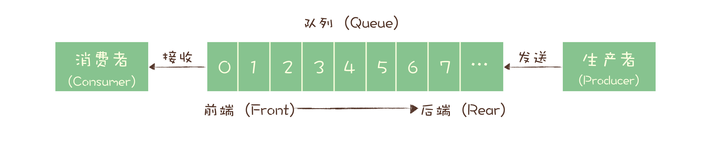
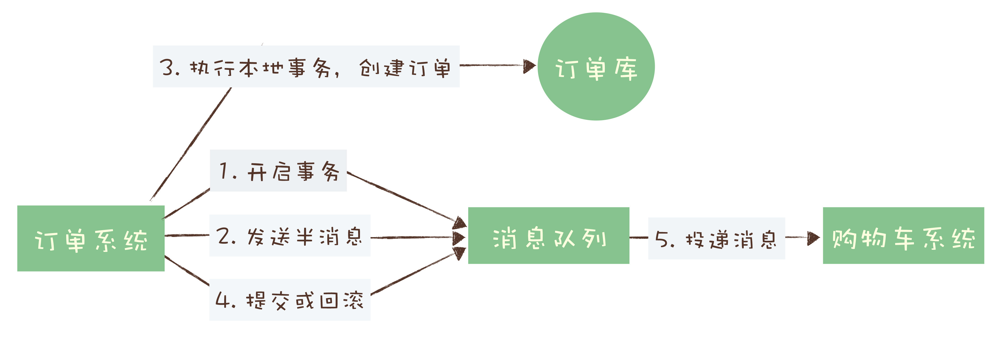
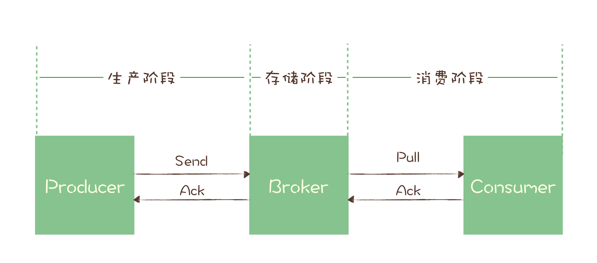

---
typora-copy-images-to:../../images
---

[TOC]

#### 一.消息队列

##### 1.定义

> 消息（Message）是指在应用间传送的数据。消息可以非常简单，比如只包含文本字符串，也可以更复杂，可能包含嵌入对象。

> 队列(Queue),先进先出(FIFO, First-In-First-Out)的线性表(Linear List).在具体应用中通常用链表或者数组来实现。队列只允许在后端（称为 rear）进行插入操作，在前端（称为 front）进行删除操作。

> 消息队列（Message Queue）是一种应用间的通信方式，消息发送后可以立即返回，由消息系统来确保消息的可靠传递。消息发布者只管把消息发布到 MQ 中而不用管谁来取，消息使用者只管从 MQ 中取消息而不管是谁发布的。这样发布者和使用者都不用知道对方的存在。

##### 2.各种工业级消息队列及其特点

1）Rabbitmq

1.在生产者和队列之间新增交换机模块

2.对消息堆积支持不好

3.客户端支持语言种类多

4.性能不高，只有几万到十几万

5.由Erlang开发

2）Rocketmq

1.阿里开源

2.性能较好，每秒可以处理几十万条消息

3.周边生态和兼容程度稍差

4.延迟很低，毫秒级响应

3）kafka

1.周边生态和兼容性最好，尤其是大数据及流计算

2.大量使用**批量**及**异步**思想，带来的问题是同步收发时延较高，因为客户端发送一条消息时kafka不会立即发送，而是攒一批一同发送。

4）其他消息队列

1.Activemq 老牌消息队列，老年期，不活跃

2.Zeromq 一个基于消息队列的多线程网络库

3.Pulsar 成长期，可持续关注，储存与计算分离

##### 3.设计模型

1）队列模型

​		这种模型下，如果有多个生产者向同一个队列例发送消息，可以将多个生产者抽象为一个。队列中可以消费的消息为生产者生产消息的合集。但是有多个消费者接收同一个队列的消息时，每条消息之恶能被一个消费者收到。也就是每个消费者只能收到队列中一部分消息。
​		如果多个消费者都需要获得全量的消息，单个队列满足不了需求，但是给每个消费者创建单独队列，生产者发送多份又会浪费资源。同时生产者还需要直到有多少个消费者，违反了解耦的设计初衷。

2）发布-订阅模型

发布-订阅模型实际是可以兼容队列模型的，当只有一个订阅者时基本与队列模型一致。

3）rabbitmq的消息模型

​		生产者不关心将消息发送给哪个队列,而是将消息发送给交换机(exchange)由交换机上配置的策略决定将消息投递到哪些队列中.可以将一份消息发送到多个队列上,这时每个队列上都存放一份完整的消息数据.

4)Rocketmq的消息模型(kafka模型相同,实现不同)

TODO

#### 二.消息与事务

##### 1.事务

###### 1.1属性(ACID)

a.原子性

> 是指一个事务操作不可分割，要么成功，要么失败，不能有一半成功一半失败的情况。

b.一致性

> 是指这些数据在事务执行完成这个时间点之前，读到的一定是更新前的数据，之后读到的一定是更新后的数据，不应该存在一个时刻，让用户读到更新过程中的数据。

c.隔离性

> 是指一个事务的执行不能被其他事务干扰。即一个事务内部的操作及使用的数据对正在进行的其他事务是隔离的，并发执行的各个事务之间不能互相干扰，这个有点儿像我们打网游中的副本，我们在副本中打的怪和掉的装备，与其他副本没有任何关联也不会互相影响。

d.持久性

> 是指一个事务一旦完成提交，后续的其他操作和故障都不会对事务的结果产生任何影响。

###### 1.2分布式事务

> 在实际应用中，比较常见的分布式事务实现有 2PC（Two-phase Commit，也叫二阶段提交）、TCC(Try-Confirm-Cancel) 和事务消息。每一种实现都有其特定的使用场景，也有各自的问题，都不是完美的解决方案。
> 在分布式系统中，在保证可用性和不严重牺牲性能的前提下，光是要实现数据的一致性就已经非常困难了，所以出现了很多“残血版”的一致性，比如**顺序一致性**、**最终一致性**等等。

###### 1.3消息队列实现

​		在第四步提交事务消息时如果失败,kafka会抛出异常让用户自行处理.可以通过业务代码中反复重试提交直到成功,或者删除之前创建的订单.rocketmq有一个事务反查机制来检查状态,根据反差结果决定提交或者回滚事务.

rocketmq实现分布式事务流程

#### 三.消息可靠传递

> 生产阶段: 在这个阶段，从消息在 Producer 创建出来，经过网络传输发送到 Broker 端。
> 存储阶段: 在这个阶段，消息在 Broker 端存储，如果是集群，消息会在这个阶段被复制到其他的副本上。
> 消费阶段: 在这个阶段，Consumer 从 Broker 上拉取消息，经过网络传输发送到 Consumer 上。

##### 1.消息丢失

###### 1.1产生情况

收到消息未来得及处理时宕机（broker或consumer）

###### 1.2解决方法

生产阶段：请求-确认机制 + 自动重试

存储阶段：刷盘策略 和 复制策略 （单节点收到消息时先写磁盘在返回确认响应，多节点先发送消息到两个以上节点再返回确认响应）

消费阶段：请求-确认机制，处理完全部消费逻辑后，再发送消费确认

##### 2.消息重复

###### 2.1质量标准

质量由低到高：

> **At most once**: 至多一次。消息在传递时，最多会被送达一次。换一个说法就是，没什么消息可靠性保证，允许丢消息。一般都是一些对消息可靠性要求不太高的监控场景使用，比如每分钟上报一次机房温度数据，可以接受数据少量丢失。
> **At least once**: 至少一次。消息在传递时，至少会被送达一次。也就是说，不允许丢消息，但是允许有少量重复消息出现。
> **Exactly once**：恰好一次。消息在传递时，只会被送达一次，不允许丢失也不允许重复，这个是最高的等级。

###### 2.2幂等性

2.2.1概念

> 幂等（Idempotence） 本来是一个数学上的概念，它是这样定义的：
>
> > 如果一个函数 f(x) 满足：f(f(x)) = f(x)，则函数 f(x) 满足幂等性。
>
> 这个概念被拓展到计算机领域，被用来描述一个操作、方法或者服务。一个幂等操作的特点是，**其任意多次执行所产生的影响均与一次执行的影响相同**。
> 对于幂等的方法，不用担心重复执行会对系统能造成任何改变。

即，幂等方法重复执行的效果等同于仅执行一次。

> 从对系统的影响结果来说：**At least once + 幂等消费 = Exactly once**。

2.2.2常用幂等方法

1)利用数据库唯一约束
		根据某一条件创建唯一约束，并进行判断。

2)为更新的数据设置前置条件
		数据变更前检查前置条件，如果条件满足则更新数据，否则拒绝。这种方法在第一次更新数据时对前置条件进行变更，这样在重复执行这一操作时后续操作就不再满足前置条件，进而不再对数据进行更新。

3)记录并检查操作
		设置全局ID，消费消息时进行检查。思路简单，但是在分布式系统中比较难实现。

###### 2.3产生情况

> 生产者已把消息发送到mq：
> 		在mq给生产者返回ack的时候网络中断，故生产者未收到确定信息，生产者认为消息未发送成功，但实际情况是，mq已成功接收到了消息，在网络重连后，生产者会重新发送刚才的消息，造成mq接收了重复的消息.
> 消费者在消费mq中的消息时：
> 		mq已把消息发送给消费者，消费者在给mq返回ack时网络中断，故mq未收到确认信息，该条消息会重新发给其他的消费者，或者在网络重连后再次发送给该消费者，但实际上该消费者已成功消费了该条消息，造成消费者消费了重复的消息；

​		总结下来就是两种情况可能导致消息重复：1.生产者发送到mq时。2.mq发送消息给消费者时。如果由于某种原因导致没能收到确认消息，会使得生产者或mq认为消息发送失败，进而重新发送。

###### 2.4解决办法

> 1.mq接收生产者传来的消息：
> 		mq内部会为每条消息生成一个全局唯一、与业务无关的消息id，当mq接收到消息时，会先根据该id判断消息是否重复发送，mq再决定是否接收该消息。
> 2.消费者消费mq中的消息：
> 		可利用mq的id来判断，或者可按自己的规则生成一个全局唯一id，每次消费消息时用该id先判断该消息是否已消费过

总结下来就是根据唯一id来确保消息不重复。

2.2从业务系统来实现幂等，2.4从mq角度来解决消息重复发送的问题，实现Exactly once级别。

> 我觉得最重要的原因是消息队列即使做到了Exactly once级别，consumer也还是要做幂等。因为在consumer从消息队列取消息这里，如果consumer消费成功，但是ack失败，consumer还是会取到重复的消息，所以消息队列花大力气做成Exactly once并不能解决业务侧消息重复的问题。

参考：[幂等性](https://zhuanlan.zhihu.com/p/269115765)

##### 3.消息积压

> 一定要保证消费端的消费性能要高于生产端的发送性能，这样的系统才能健康的持续运行

#### 四.扩展

参考：[消息队列适合解决的问题](https://www.cnblogs.com/chjxbt/p/11377402.html)

异步与同步：

> 异步相比与同步的优势在于：同步等待的时间被异步的方式拿来接受新的请求了。因此相同线程的数量下，异步支持的并发和吞吐量都高的多。
