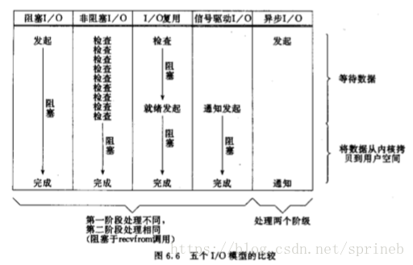

#### 一.内存组成

1.栈区**(Stack)**

编译器在程序运行时自动分配释放，存放函数的参数，返回值，局部变量。在编译时确定，函数执行结束后栈变量释放（不是清空，被表示成未使用，是可使用状态）

2.堆区**(Heap)**

是c和操作系统的术语，是操作系统维护的一块特殊内存，提供了动态分配的功能。运行程序时调用malloc()会从中分配，之后调用free就会交还内存。

堆和栈的区别

3.自由储存区**(Free Storage)**

是C++中通过new和delete动态分配和释放对象的抽象概念，通过new来申请的内存区域可称为自由存储区。基本上，所有的C++编译器默认使用堆来实现自由存储，也即是缺省的全局运算符new和delete也许会按照malloc和free的方式来被实现，这时藉由new运算符分配的对象，说它在堆上也对，说它在自由存储区上也正确。但程序员也可以通过重载操作符，改用其他内存来实现自由存储，例如全局变量做的对象池，这时自由存储区就区别于堆了。

自由储存和堆：

1）自由存储是C++中通过new与delete动态分配和释放对象的**抽象概念**，而堆（heap）是C语言和操作系统的术语，是操作系统维护的一块动态分配内存。

2）new所申请的内存区域在C++中称为自由存储区。藉由堆实现的自由存储，可以说new所申请的内存区域在堆上。

3）堆与自由存储区还是有区别的，它们并非等价。

4.全局区/静态区**(Global Static Area)**

全局变量和静态变量分配到的一块内存，c中还分为初始化和未初始化的区域

> 初始化的全局变量和静态变量在一块区域，未初始化的全局变量与静态变量在相邻的另一块区域，同时未被初始化的对象存储区可以通过 void* 来访问和操纵，程序结束后由系统自行释放

参考文章:

[全局区/静态区](https://www.cnblogs.com/daocaoren/archive/2011/06/29/2092957.html)

c++中会自动给全局变量和静态变量赋值。

另：全局变量会一直占据内存空间直到程序结束后释放。

5.常量储存区

专门存储不能修改的常量，如const修饰的常数和字符串等（如果采用非正常手段更改当然也是可以的了）。

参考文章:

[堆与自由储存](https://www.cnblogs.com/QG-whz/p/5060894.html)

[C++代码区、全局区、栈区、堆区的详细介绍](http://www.itcast.cn/news/20200331/17085293974.shtml)

[【c++基础】6.内存机制、指针、引用、动态数组及实例](https://blog.csdn.net/guwuchangtian/article/details/72953918)

6.堆栈溢出

堆溢出：程序使用的空间在程序结束后没有释放造成该部分空间无法继续使用产生的溢出

栈溢出：函数递归调用不当产生的死循环导致栈空间消耗光产生的溢出。(ps:栈在内存中的生长方向向下，具有固定大小（最小值），超过就会造成溢出)

#### 二.内存分配

1.从静态存储区分配

> 内存在程序编译的时候已经分配好，这块内存在程序的整个运行期间都存在。例如全局变量，static变量。

2.在栈上创建

> 在执行函数时，函数内局部变量的存储单元可以在栈上创建，函数执行结束时，这些内存单元会自动被释放。 
> 栈内存分配运算内置于处理器的指令集，效率高，但是分配的内存容量有限。

3.从堆上分配

> 亦称为动态内存分配。 
> 程序在运行的时候使用malloc或者new申请任意多少的内存，程序员自己负责在何时用free或delete释放内存。 
> 动态内存的生命周期有程序员决定，使用非常灵活，但如果在堆上分配了空间，既有责任回收它，否则运行的程序会出现内存泄漏，频繁的分配和释放不同大小的堆空间将会产生内存碎片。

参考文章:

[C/C++程序内存的分配](https://blog.csdn.net/cherrydreamsover/article/details/81627855)

#### 三.地址间接操作

1.指针

1）取指针内容符号*

2）取地址符号&

2.引用

3.动态数组

指针、引用、动态数组参考文章:

[【c++基础】6.内存机制、指针、引用、动态数组及实例](https://blog.csdn.net/guwuchangtian/article/details/72953918)

#### 四.内存池

1.基础知识

[第1篇:C++ 堆内存管理器-allocator](https://www.jianshu.com/p/d7be8a1d9010)

[c++在指定内存构造对象](https://blog.csdn.net/choubu1703/article/details/100655131)

 参考文章：

[C++11实现高效内存池](https://bincode.blog.csdn.net/article/details/116356478?spm=1001.2101.3001.6650.1&utm_medium=distribute.pc_relevant.none-task-blog-2~default~CTRLIST~default-1.pc_relevant_paycolumn_v2&depth_1-utm_source=distribute.pc_relevant.none-task-blog-2~default~CTRLIST~default-1.pc_relevant_paycolumn_v2&utm_relevant_index=2)

[c++实现高性能内存池](https://blog.csdn.net/xjtuse2014/article/details/52302083)

[C++ STL内存池](https://www.cnblogs.com/xiaoxue126/p/9007047.html)

[C++实现内存池](https://blog.csdn.net/u010183728/article/details/81531392)

实现步骤（演进）[如何设计内存池](https://www.zhihu.com/question/25527491/answer/56566079)

#### 五.问题及排查

##### 1.踩内存

> 踩内存就是访问了不应该访问的内存地址，比如过说数组或内存越界啊，指针未初始化啊或使用的时候已经被释放掉啊等都会造成踩内存的现象。

> 那么我们为了避免出现这种低级bug，需要养成：
> 1.入参一定要做边界检查，防止溢出
> 2.代码不要嵌套太深，在多线程多通道的场景下，很容易重复释放/申请资源
> 3.不要定义过多的局部变量，数组，防止栈溢出，内核中栈的大小是8k吧。看情况使用kmalloc
> 4.释放了的资源及时置空，如果不是立马就return的话。分支比较多的代码，很容易就~~~

> Q：出现了踩内存应该如何排查？
> A：通过gdb进行调试定位出问题的代码，如果是随机踩的情况，可以借助valgrind工具进行排查。

引用：[踩内存](https://blog.csdn.net/weixin_39951112/article/details/111124947)

