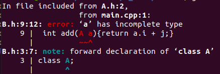
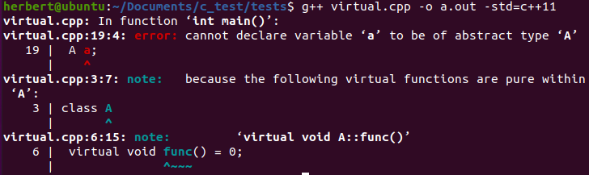
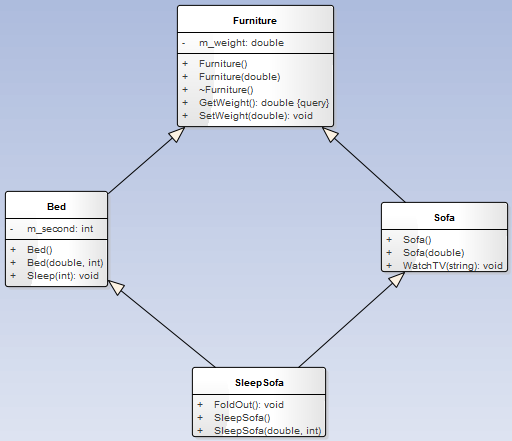

[TOC]

#### 一.类成员

##### 1.成员函数

###### 1.1类成员函数this指针

从汇编角度解析：[类成员函数隐藏参数this](https://blog.csdn.net/qiuguolu1108/article/details/114799722)

说明：[类成员中隐藏的this指针（C ++入门笔记二）](https://blog.csdn.net/qq_41249760/article/details/120692318?spm=1001.2101.3001.6650.1&utm_medium=distribute.pc_relevant.none-task-blog-2~default~CTRLIST~default-1.pc_relevant_aa&depth_1-utm_source=distribute.pc_relevant.none-task-blog-2~default~CTRLIST~default-1.pc_relevant_aa&utm_relevant_index=2)

类的成员函数会隐含传入一个默认参数：this指针，在使用bind绑定函数时要注意，需要自己传入this指针到第一个参数中。

通过lambda捕获this指针：

```c++
#include <iostream>
using namespace std;
class P
{
public:
        P(int _p, int _q):p(_p), q(_q){};
        P() = delete;
        int get();
        int m_lam();
private:
        int p,q;
};
int P::get()
{
        return p+q;
}
int P::m_lam()
{
    	//这里使用lambda将this指针变量捕获
    	auto func = [this](){ return this->get();};
    	return func();
}
int main()
{
    	P p1(1,2);
    	printf("%d\n", p1.m_lam());
}
//输出结果为3
```

###### 1.2 inline内联函数

1）实例

```c++
#include <stdio.h>
 
inline const char *num_check(int v)
{
    return (v % 2 > 0) ? "奇" : "偶";
}
 
int main(void)
{
    int i;
    for (i = 0; i < 100; i++)
        printf("%02d   %s\n", i, num_check(i));
    return 0;
}
/*
效果：在内部的工作就是在每个 for 循环的内部任何调用 dbtest(i) 的地方都换成了 (i%2>0)?"奇":"偶"，这样就避免了频繁调用函数对栈内存重复开辟所带来的消耗。
*/
```

2）inline性质及使用

inline仅是对编译器的建议

> **inline** 函数仅仅是一个对编译器的建议，所以最后能否真正内联，看编译器的意思，它如果认为函数不复杂，能在调用点展开，就会真正内联，并不是说声明了内联就会内联，声明内联只是一个建议而已。

inline是“用于实现的关键字”

> 关键字 **inline** 必须**与函数定义体放在一起**才能使函数成为内联，仅将 **inline** 放在函数声明前面不起任何作用。
> 如下风格的函数 **Foo** 不能成为内联函数：

```c++
inline void Foo(int x, int y); // inline 仅与函数声明放在一起
void Foo(int x, int y){}
```

使用限制

> **inline** 的使用是有所限制的，inline 只适合涵数体内代码简单的涵数使用，不能包含复杂的结构控制语句例如 while、switch，并且不能内联函数本身不能是直接递归函数（即，自己内部还调用自己的函数）。

> **定义**在类中的**成员函数**默认都是**内联的**，如果在类定义时就在类内给出函数定义，那当然最好。如果在类中未给出成员函数定义，而又想内联该函数的话，那在类外要加上 **inline**，否则就认为不是内联的。

```c++
class A
{
    public:void Foo(int x, int y) {  } // 自动地成为内联函数
}
//改为如下风格更佳
// 头文件
class A
{
    public:
    void Foo(int x, int y);
}
// 定义文件
inline void A::Foo(int x, int y){}
```

参考:[C++ 中的 inline 用法](https://www.runoob.com/w3cnote/cpp-inline-usage.html)

##### 2.成员变量

1）c++中类的成员变量默认为私有，而结构体（struct）默认为公有。

2）使用std::function可以绑定函数传入类对象返回类成员变量（调用类公有成员）。

```c++
#include <iostream>
#include <functional>
using namespace std;

class Plus
{
	public:
    	Plus(int num_):num(num_){}
	    int plus(int a, int b)
	    {
	        return a + b;
	    }
	   int  num;
};

int main()
{
    const Plus p(2);
    function<int(const Plus&)> f = &Plus::num;
  //function<int(const Plus)> f = &Plus::num;
    cout << f(p) << endl;     //2
    system("pause");                                       
    return 0;
}

```

参考：[C++11 function类模板](https://blog.csdn.net/qq_35721743/article/details/83217416)

#### 二.友元函数

##### 1.普通非类成员作为友元函数

示例：

```c++
#include <iostream>
using namespace std;
class P
{
public:
        P(int _p, int _q):p(_p), q(_q){};
        P() = delete;
        int get();
        friend int add(P &a, P &b);
private:
        int p,q;
};
int P::get()
{
        return p+q;
}
int add(P &a, P &b)
{
        return a.p + a.q + b.p + b.q;
}
int main()
{
        P p1(1,2);
		P p2(3,4);
        printf("%d\n", add(p1, p2));
}
//输出结果为10
```


##### 2.类作为友元

> 类作为友元需要注意的是**友元类**和**原始类**之间的相互依赖关系，如果在**友元类**中定义的函数使用到了**原始类**的私有变量，那么就需要在**友元类**定义的文件中包含**原始类**定义的头文件。但是在**原始类**的定义中(包含**友元类**声明的那个类)，就不需要包含**友元类**的头文件。另外，不需要在类定义前去声明**友元类**，因为**友元类**的声明自身就是一种声明。

```c++
//A.h  
#pragma once  
#include <iostream>  
using namespace std;  
class A  
{  
	//friend class B;  //如果不写这句话将会出现编译错误
public:  
	~A() = default;  
	A();
private:    
	int m_nItem;
}; 
//A.cpp
#include "A.h"
A::A()
{
	m_nItem =3;
}
//B.h
#pragma once  
class B  
{  
public:  
	B() = default;  
	~B() = default;  
	int func();  
};  
//B.cpp
#include "StdAfx.h"
#include "B.h"  
#include "A.h" //must include A.h 
#include <iostream> 
int B::func()  
{  
	cout<<"This is in B"<<endl;  
	A a;
	return a.m_nItem;
}  

```


##### 3.类成员作为友元函数

> 与将类作为友元有所不同, 要将类成员函数作为友元，在声明友元的时候要用类限定符，所以必须先定义包含友元函数的类，但是在定义友元函数时候，又必须事先定义原始类。通常的做法先定义包含友元函数的类，再定义原始类，这个顺序不能乱。(如果是友元类，则没有这种这种必须)如下面所示：

```c++
//A.h
#pragma once
#include "B.h"
class A
{
        friend int B::add(A a);
public:
        A(int _i):i(_i){};
        ~A() = default;
private:
        int i;
};

//B.h
#pragma once
//#include "A.h"
class A;
class B
{
public:
        B(int _j):j(_j){};
        ~B() = default;
        int add(A a);//{return a.i + j;}
private:
        int j;
};
/*直接在.h文件中定义会导致编译器识别不到,需要定义在.cpp文件中,如图1
int B::add(A a)
{
        return a.i + j;
}
*/

//B.cpp
#include "B.h"
#include "A.h"

int B::add(A a)
{
        return a.i + j;
}

//main.cpp
#include "A.h"
#include "B.h"
#include <iostream>
using namespace std;
int main()
{
        A a(2);
        B b(3);
        printf("%d\n", b.add(a));
}

//编译命令:g++ main.cpp B.cpp -o a.out -std=c++11
```



​																					图1

##### 4.性质

a.友元不具有相互性，只具有单项性

> 若类B是类A的友元，类A不一定是类B的友元，要看在类中是否有相应的声明。

b.友元不能被继承

> B是A的友元类，C是B的子类，推不出C是A的友元

c.友元不具有传递性

> B是A的友元，C是B的友元，推不出C是A的友元

##### 5.用法

a.单例模式中构造

b.运算符重载的某些场合需要使用友元  

c.两个类要共享数据的时候

##### 6.参考文章

[C++中的friend详细解析](https://blog.csdn.net/u012861978/article/details/52095607)

[C++之中的友元函数的作用](https://blog.csdn.net/andrewgithub/article/details/78760381)

##### 7.拓展

[forward declaration of class 错误](https://blog.csdn.net/weixin_33919941/article/details/86422168)

> 可以声明一个类而不定义它
> class Screen;//declaration of the Screen class
> 这个声明,有时候被称为**前向声明**(forward declaration),在程序中引入了类类型的Screen.在声明之后,定义之前,类Screen是一个**不完全类型**(incomplete type),即已知Screen是一个类型,但不知道包含哪些成员.
> 不完全类型只能以有限方式使用,**不能定义该类型的对象**,不完全类型只能用于定义指向该类型的指针及引用,或者用于声明(而不是定义)使用该类型作为形参类型或返回类型的函数.

#### 三.default和delete函数

##### 1.特殊成员函数

c++类中有四类特殊成员函数，分别是：**默认构造函数**、**析构函数**、**拷贝构造函数**、**拷贝赋值运算符**

##### 2.default和delete函数

> 在未显式的定义类的特殊成员函数时，如果被调用，系统会自动隐式的创建该特殊成员函数，且隐式的创建方式比显式的创建方式执行效率高。

default函数

> 只需在函数声明后加上`=default;`，就可将该函数声明为 defaulted 函数，编译器将为显式声明的 defaulted 函数自动生成函数体，以获得更高的执行效率。

delete函数

> 有些时候，我们需要禁用某些函数(`=delete`不仅可以禁用类内的特殊成员函数，也可以禁用一般函数)，此时就需要在该函数后面增加`=delete；`，则该函数将变的不可调用，比如不可复制等。

参考

[C++类的特殊成员函数及default/delete特性](https://zhuanlan.zhihu.com/p/77806109)

```c++
// "=delete"函数特性还可以用来禁用某些用户自定义的类的 new 操作符，从而避免在自由存储区创建类的对象
class X5
{
public:
    void *operator new(size_t) = delete;
    void *operator new[](size_t) = delete;
};
```

[c++11 类默认函数的控制："=default" 和 "=delete"函数](https://www.cnblogs.com/jianlongzaitian/p/14076302.html)


#### 四.模板类

#### 五.接口和抽象类

#### 六.类的构造

##### 1.使用new创建类指针

> a. new创建类对象需要指针接收，一处初始化，多处使用
> b. **new创建类对象使用完需delete销毁**
> c. new创建对象直接使用堆空间，而局部不用new定义类对象则使用栈空间
> d. new对象指针用途广泛，比如作为函数**返回值**、**函数参数**等.(ps:使用指针作为函数返回值,参数等可以减少资源占用.另外指针可以实现多态)
> e. 频繁调用场合并不适合new，就像new申请和释放内存一样

##### 2.类对象与类指针区别

###### 2.1定义

> **类对象**:利用类的构造函数(构造函数:对类进行初始化工作)在内存中分配一块区域(包括一些成员变量赋值);
> **类指针**:是一个内存地址值,指向内存中存放的类对象(包括一些成员变量赋值;类指针可以指向多个不同的对象,这就是多态);

###### 2.2使用

> **引用成员**:对象使用"."操作符,指针使用"->"操作符
> **生命周期**:若是成员变量，则由类的析构函数来释放空间；若是函数中临时变量，则作用域是函数体内；而指针则需要利用delete在相应的地方释放分配的内存块。(ps:new与delete成对存在)

###### 2.3储存位置

> **类对象**:使用内存栈,是个局部的临时变量
> **类指针**:使用内存堆,是个永久变量,除非使用delete释放

###### 2.4多态

> 指针可以实现多态,直接使用对象不行

###### 2.5访问方式

> 指针变量是间接访问，但可实现多态（通过父类指针可调用子类对象），并且没有调用构造函数； 
> 直接声明可直接访问，但不能实现多态，声明即调用了构造函数（已分配了内存）。

```c++
#include <iostream>
using namespace std;
class A
{
public:
        int i;
};
class B
{
public:
        A a;
        int getA();
        void init(int n);
};
int B::getA()
{
        return a.i;
}
void B::init(int n)
{
        a.i = n;
}
//B类型的引用(引用可以理解为指针的语法糖)
void p1(B &b)
{
        printf("%d\n",b.getA());
}
//B指针类型的引用,*与&位置对调会报错
void p2(B* &b)
{
        printf("%d\n", b->getA());
}
int main()
{
        B b;
        b.init(12);
        p1(b);
        //printf("%d\n", b.getA());
        B* b2 = new B();
        b2->init(13);
        p2(b2);
    	p1(*b2);//可以传入指针b2的解引用使用p1()
        //printf("%d\n", b2->getA());
}

```

##### 3.类对象与类指针联系

> 在类的声明尚未完成的情况下，可以声明指向该类的指针，但是不可声明该类的对象； 
> 父类的指针可以指向子类的对象

##### 4.指针与多态

> 类指针是一个指向内存中存放类对象的内存地址值，那么这个指针可以指向多个不同的对象，这就是多态；
> 拓展：指针与虚函数 
> 要发挥虚函数的强大作用，必须使用指针来访问对象。
> 当类是有虚函数的基类，Func是它的一个虚函数,则调用Func时： 
> **类对象**：调用的是它自己的Func； 
> **类指针**：调用的是分配给它空间时那种类的Func。

##### 5.使用场景

基本作用: 为了调用类的成员变量和成员函数. 

> 当你希望明确使用这个类的时候，最好使用对象；

> 如果你希望使用C++中的[动态绑定](https://zhuanlan.zhihu.com/p/216258189?utm_source=wechat_timeline)，则最好使用指针或者引用，指针和引用用起来更灵活，容易实现多态等。

##### 6.参考文章:

[C++中类对象与类指针的区别](https://www.cnblogs.com/xiuzhublog/p/13734004.html)

[C++用new和不用new创建类对象区别](https://www.cnblogs.com/liulipeng/p/3524496.html)

##### 7.拓展

###### 7.1单例模式

[单例模式](https://blog.csdn.net/zhanghuaichao/article/details/79459130)中,懒汉模式是定义一个指针,饿汉模式是定义一个对象.

单例模式总结:[C++ 单例模式 Singleton](https://blog.csdn.net/sinat_43125576/article/details/120734259)

c++类中是不能定义自身的对象的，但是java可以（只能声明，不能直接new）

```java
class A{
  A aa;
}
//这种写法c++中编译不通过，Java中是可以的，不过如果换成
class A{
  A aa=new A();
}
//就会出错。
```

###### 7.2子类调用父类构造函数

```c++
#include <iostream>
using namespace std;
class A
{
private:
protected:
    int temA;
public:
    A(int n):temA(n){};
    ~A() = default;
};

class B : public A
{
private:
    int temB;
public:
    void printB(){printf("%d, %d\n",temB, temA);};
    B(int n, int m):A(n), temB(m){};//子类调用父类构造函数构造一部分参数
    ~B() = default;
};

int main()
{
    int t1 = 0;
    int t2 = 1;
    B b(t1, t2);
    b.printB();
}
```


#### 七.类的性质

##### 1.继承

[深入理解C++中public、protected及private用法](https://www.jb51.net/article/54224.htm)

##### 2.虚继承与多继承

参考：[C++中类的多继承](https://sunlogging.blog.csdn.net/article/details/46959173?spm=1001.2101.3001.6650.3&utm_medium=distribute.pc_relevant.none-task-blog-2~default~CTRLIST~Rate-3.pc_relevant_paycolumn_v3&depth_1-utm_source=distribute.pc_relevant.none-task-blog-2~default~CTRLIST~Rate-3.pc_relevant_paycolumn_v3)

###### 2.1纯虚函数

类中方法=0

例：

```c++
//包含纯虚函数的类为抽象类，不能直接构造对象，只有实现了这个纯虚函数的子类才能构造
class A
{
    virtual void func1() = 0;//纯虚函数
}
```

实例：

```c++
#include <iostream>
using namespace std;
class A
{
public:
        virtual void func() = 0;
};
class B : public A
{
public:
        void func() override;
};
void B::func()
{
printf("111");
}
int main()
{
        B b;
        b.func();
}
/*int main()
{
        A a;//会报错如图2.1
}
*/
```




​																					图2.1

###### 2.2虚继承

```c++
class Furniture{……};

class Bed : virtual public Furniture{……}; // 这里我们使用虚继承

class Sofa : virtual public Furniture{……};// 这里我们使用虚继承

class SleepSofa : public Bed, public Sofa {……};
```

这样，Furniture类就只会构造一次，sleepSofa对象只会包含一个Furniture对象。 

否则sleepSofa对象会包含两个Furniture对象



#### 八.运算符重载

1.格式

```c++
bool operator == (Spot spot) const{};//要声明方法为const方法
```

