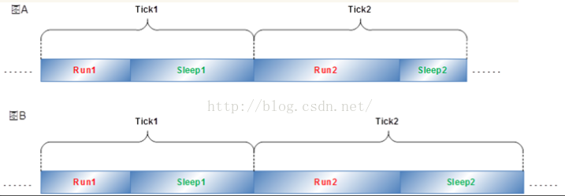

#### 一.Tcp

Tcp三次握手和四次挥手

https://blog.csdn.net/whuslei/article/details/6667471

【问题1】为什么连接的时候是三次握手，关闭的时候却是四次握手？
答：因为当Server端收到Client端的SYN连接请求报文后，可以直接发送SYN+ACK报文。其中ACK报文是用来应答的，SYN报文是用来同步的。但是关闭连接时，当Server端收到FIN报文时，很可能并不会立即关闭SOCKET，所以只能先回复一个ACK报文，告诉Client端，"你发的FIN报文我收到了"。只有等到我Server端所有的报文都发送完了，我才能发送FIN报文，因此不能一起发送。故需要四步握手。

【问题2】为什么TIME_WAIT状态需要经过2MSL(最大报文段生存时间)才能返回到CLOSE状态？

答：虽然按道理，四个报文都发送完毕，我们可以直接进入CLOSE状态了，但是我们必须假象网络是不可靠的，有可以最后一个ACK丢失。所以TIME_WAIT状态就是用来重发可能丢失的ACK报文。

**ps:只有发起连接终止的一方会进入 TIME_WAIT 状态**

**例图：**

三次握手




四次挥手


#### 二.socket

##### 1.步骤

###### 1.1服务端

1）加载套接字库，创建套接字（socket()/WSAStartup()）；

2）绑定套接字到一个IP地址和一个端口上（bind()）；

3）将套接字设置为监听模式等待连接请求（listen()）；

4）请求到来后，接受连接请求，返回一个新的对应与此次连接的套接字（accept()）；

5）用返回的套接字和客户端进行通信（send()/recv()）；

6）返回，等待另一连接请求；

7）关闭套接字，关闭加载的套接字库（closesocket()/WSACleanup()）。

1.2客户端

1）加载套接字库，创建套接字(socket()/WSAStartup())；

2）向服务器发出连接请求(connect())；

3）和服务器端进行通信(send()/recv())；

4）关闭套接字，关闭加载的套接字库(closesocket()/WSACleanup())。

参考：[C++ Socket编程步骤](https://www.cnblogs.com/Sniper-quay/archive/2011/06/22/2086636.html)


##### 2.细节

###### 2.1 socket

```c++
int socket(int domain, int type, int protocol);
　　/*在参数表中，domain指定使用何种的地址类型，比较常用的有：
　　PF_INET, AF_INET： Ipv4网络协议；
　　PF_INET6, AF_INET6： Ipv6网络协议。
　　type参数的作用是设置通信的协议类型，可能的取值如下所示：
　　SOCK_STREAM： 提供面向连接的稳定数据传输，即TCP协议。
　　OOB： 在所有数据传送前必须使用connect()来建立连接状态。
　　SOCK_DGRAM： 使用不连续不可靠的数据包连接。
　　SOCK_SEQPACKET： 提供连续可靠的数据包连接。
　　SOCK_RAW： 提供原始网络协议存取。
　　SOCK_RDM： 提供可靠的数据包连接。
　　SOCK_PACKET： 与网络驱动程序直接通信。
　　参数protocol用来指定socket所使用的传输协议编号。这一参数通常不具体设置，一般设置为0即可
　　或者指定为IPPROTO_TCP
　　*/

```

参考：

[socket函数的使用方法（参数详解）](https://www.cnblogs.com/zhangyabin---acm/p/3198363.html)

[socket的protocal参数](https://www.cnblogs.com/liyulong1982/p/6904007.html)

###### 2.2 bind

函数原型

```c++
int bind(int sockfd, const struct sockaddr *addr,socklen_t addrlen);
```

例：

```c++
struct sockaddr_in serv_addr; //定义sockaddr_in结构体
serv_addr.sin_family = AF_INET; // 设置地址族为IPv4
serv_addr.sin_port = htons(SERPORT); // 设置地址的端口号信息
serv_addr.sin_addr.s_addr = inet_addr(SERADDR); //　设置IP地址
ret = bind(sockfd, (const struct sockaddr *)&serv_addr, sizeof(serv_addr));
```


###### 2.1 listen

设置socket和sock结构体的标记和状态，设置syn和已连接队列的上限。

函数原型：

```c++
int listen(int sockfd, int backlog);
```

> 参数sockfd
>
> 被listen函数作用的套接字，sockfd之前由socket函数返回。在被socket函数返回的套接字fd之时，它是一个主动连接的套接字，也就是此时系统假设用户会对这个套接字调用**connect函数**，期待它主动与其它进程连接，然后在服务器编程中，用户希望这个套接字可以接受外来的连接请求，也就是被动等待用户来连接。**由于系统默认时认为一个套接字是主动连接的，所以需要通过某种方式来告诉系统，用户进程通过系统调用listen来完成这件事。**

> 参数backlog
>
> 这个参数涉及到一些网络的细节。在进程正理一个一个连接请求的时候，可能还存在其它的连接请求。因为TCP连接是一个过程，所以可能存在一种半连接的状态，有时由于同时尝试连接的用户过多，使得服务器进程无法快速地完成连接请求。如果这个情况出现了，服务器进程希望内核如何处理呢？**内核会在自己的进程空间里维护一个队列以跟踪这些完成的连接但服务器进程还没有接手处理或正在进行的连接，这样的一个队列内核不可能让其任意大，所以必须有一个大小的上限。**这个backlog告诉内核使用这个数值作为上限。
>
> 毫无疑问，服务器进程不能随便指定一个数值，内核有一个许可的范围。这个范围是实现相关的。很难有某种统一，一般这个值会小30以内。

2.2 accept

> accept()函数不参与三次握手，而只负责从建立连接队列中取出一个连接和socketfd进行绑定

函数调用

> 会从已连接队列中取出一个“连接”，未完成队列和已完成队列中连接目之和将减少1；即accept将监听套接字对应的sock的接收队列中的已建立连接的sk_buff取下(从该sk_buff中可以获得对端主机的发送过来的tcp/ip数据包)

参考：

[socket中的listen到底干了哪些事情](https://www.cnblogs.com/still-smile/p/13611270.html)

[网络编程socket之listen函数](https://www.cnblogs.com/fnlingnzb-learner/p/8523508.html)

