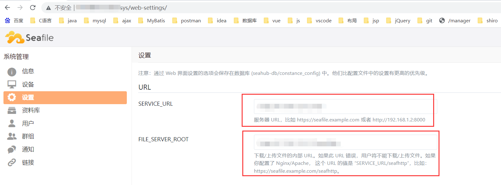

想在Ubuntu系统下使用docker部署seafile服务

```yml
version: '2.0'
services:
  db:
    image: mariadb:10.1
    container_name: seafile-mysql
    environment:
      - MYSQL_ROOT_PASSWORD=db_dev  # Requested, set the root's password of MySQL service.
      - MYSQL_LOG_CONSOLE=true
    volumes:
      - /opt/seafile-mysql/db:/var/lib/mysql  # Requested, specifies the path to MySQL data persistent store.
    networks:
      - seafile-net

  memcached:
    image: memcached:1.5.6
    container_name: seafile-memcached
    entrypoint: memcached -m 256
    networks:
      - seafile-net

  seafile:
    image: seafileltd/seafile-mc:latest
    container_name: seafile
    ports:
            - "80:80" 
            - "8000:8000"
#            - "443:443"  # If https is enabled, cancel the comment.
    volumes:
      - /opt/seafile-data:/shared   # Requested, specifies the path to Seafile data persistent store.
    environment:
      - DB_HOST=db
      - DB_ROOT_PASSWD=db_dev  # Requested, the value shuold be root's password of MySQL service.
#      - TIME_ZONE=Asia/Shanghai # Optional, default is UTC. Should be uncomment and set to your local time zone.
      - SEAFILE_ADMIN_EMAIL=me@example.com #可以修改为自己的邮箱 #Specifies Seafile admin user, default is 'me@example.com'.
      - SEAFILE_ADMIN_PASSWORD=asecret     #可以修改为自己的密码 #Specifies Seafile admin password, default is 'asecret'.
      - SEAFILE_SERVER_LETSENCRYPT= false  #false即可 # Whether to use https or not.
      - SEAFILE_SERVER_HOSTNAME= http://localhost #修改为自己的服务器网址或IP地址 # Specifies your host name if https is enabled.
    depends_on:
      - db
      - memcached
    networks:
      - seafile-net
networks:
  seafile-net:

```

​		参考[Docker SeaFile快速部署](https://www.jianshu.com/p/1a2c60e3f118)添加docker-compose.yml如上，注意需要页面访问需要服务器防火墙开放80端口，并且80端口不能被其他服务(如apache等)占用，除此之外要开放8082端口客户端才能下载文件。(或许可以修改默认端口，使用其他端口来访问seafile服务)。貌似是因为yml文件开头使用的version为2，所以采用的python版本为python2，可能会产生一些python的兼容问题。

​		参考[seafile-pro专业版docker-compose安装](https://www.jianshu.com/p/25d73135fb66)中的[https://customer.seafile.com/downloads/](https://links.jianshu.com/go?to=https%3A%2F%2Fcustomer.seafile.com%2Fdownloads%2F)登录(未确定是否必要--TODO)

​		执行了`sudo docker-compose up -d`启动后还需要通过`docker exec -it docker_id /bin/bash`进入docker,`cd /opt/seafile/seafile-server-9.0.4`进入seafile文件夹执行`./seafile.sh start`启动seafile服务。

​		使用yml配置的账号密码进入seafile管理页面，修改此两处URL。即可进行文件上传下载访问。参考[docker部署seafile](https://blog.csdn.net/qq_42289214/article/details/119107011)


