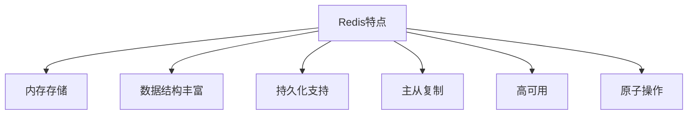
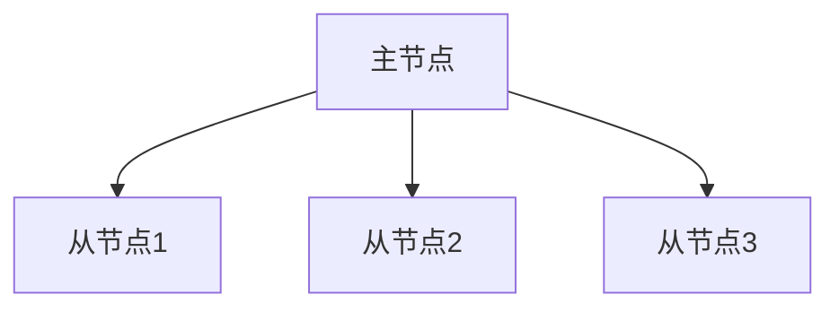
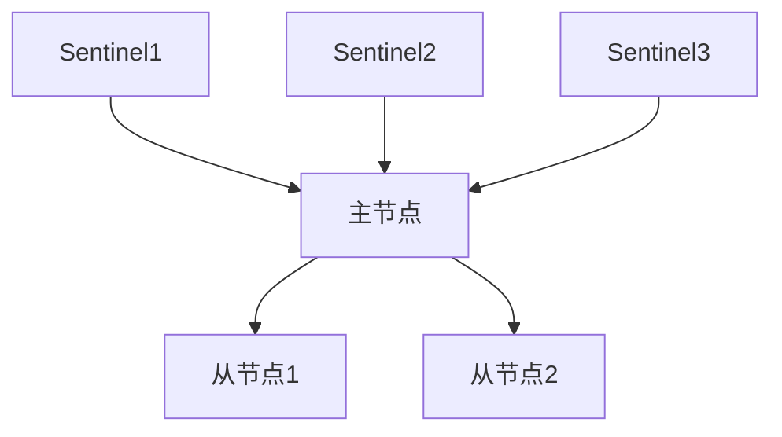
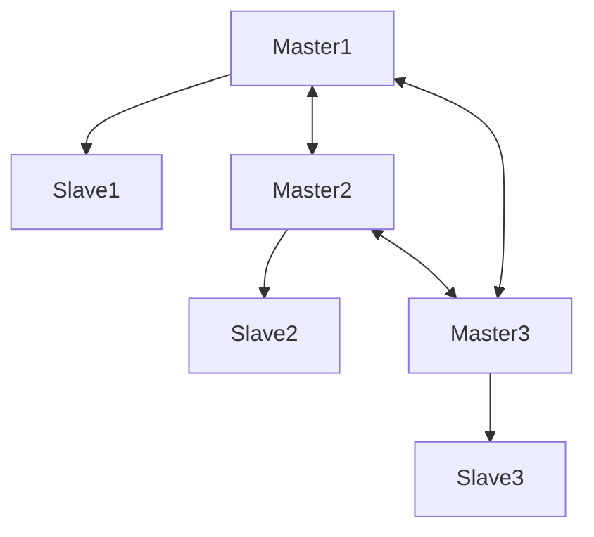
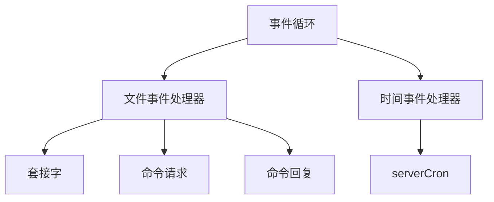

# Redis入门指南

## 基本概念

Redis (Remote Dictionary Server) 是一个开源的内存数据结构存储系统，可以用作数据库、缓存、消息中间件等。

### 主要特点



1. 内存存储：所有数据都存在内存中，读写速度快
2. 数据结构丰富：支持多种数据类型
3. 持久化支持：可以将数据保存到磁盘
4. 主从复制：支持数据备份和读写分离
5. 高可用：支持集群部署
6. 原子操作：保证数据一致性

## 数据类型

### String（字符串）
最基本的数据类型，可以存储字符串、整数或浮点数。

```bash
# 设置键值对
SET key value
# 设置过期时间
SETEX key seconds value
# 不存在时设置（可用于分布式锁）
SETNX key value
# 获取值
GET key
# 批量操作
MSET key1 value1 key2 value2
MGET key1 key2
```

### Hash（哈希）
存储对象，类似于字典。

```bash
# 设置单个字段
HSET key field value
# 获取单个字段
HGET key field
# 设置多个字段
HMSET key field1 value1 field2 value2
# 获取所有字段和值
HGETALL key
```

### List（列表）
有序的字符串列表。

```bash
# 左侧插入
LPUSH key value1 value2
# 右侧插入
RPUSH key value1 value2
# 获取列表范围
LRANGE key start stop
# 移除并返回元素
LPOP key
RPOP key
```

### Set（集合）
无序的字符串集合，元素不重复。

```bash
# 添加元素
SADD key member1 member2
# 获取所有元素
SMEMBERS key
# 判断元素是否存在
SISMEMBER key member
# 集合运算
SINTER key1 key2 # 交集
SUNION key1 key2 # 并集
SDIFF key1 key2  # 差集
```

### Sorted Set（有序集合）
有序的字符串集合，每个元素关联一个分数。

```bash
# 添加元素
ZADD key score1 member1 score2 member2
# 获取范围元素
ZRANGE key start stop [WITHSCORES]
# 获取分数范围内的元素
ZRANGEBYSCORE key min max
```

## 部署方式

### Docker部署

1. 基本部署
```bash
docker run -d -p 6379:6379 \
--name redis \
--restart=always \
redis
```

2. 自定义配置部署
```bash
docker run -d -p 16379:6379 \
--name redis \
--restart=always \
--network woniu_network \
--ip 172.0.0.1 \
-v /root/redis/data:/data \
-v /root/redis/conf/redis.conf:/etc/redis/redis.conf \
-v /root/redis/downloads:/usr/Downloads \
redis \
redis-server /etc/redis/redis.conf \
--appendonly yes
```

### 配置说明

1. 基本配置
```conf
# 绑定地址
bind 0.0.0.0
# 端口
port 6379
# 密码
requirepass yourpassword
# 最大内存
maxmemory 2gb
# 内存策略
maxmemory-policy allkeys-lru
```

2. 持久化配置
```conf
# RDB持久化
save 900 1      # 900秒内有1个修改
save 300 10     # 300秒内有10个修改
save 60 10000   # 60秒内有10000个修改

# AOF持久化
appendonly yes
appendfilename "appendonly.aof"
appendfsync everysec
```

## 高可用方案

### 主从复制



配置从节点：
```conf
slaveof <masterip> <masterport>
```

### 哨兵模式



哨兵配置：
```conf
sentinel monitor mymaster 127.0.0.1 6379 2
sentinel down-after-milliseconds mymaster 5000
sentinel failover-timeout mymaster 60000
```

### 集群模式



集群配置：
```conf
cluster-enabled yes
cluster-config-file nodes.conf
cluster-node-timeout 5000
```

## C++访问Redis

### 使用hiredis

1. 连接Redis
```cpp
// 无超时连接
redisContext *c = redisConnect("127.0.0.1", 6379);

// 带超时连接
struct timeval timeout = { 1, 500000 }; // 1.5 seconds
redisContext *c = redisConnectWithTimeout("127.0.0.1", 6379, timeout);

// 检查连接
if (c == NULL || c->err) {
    if (c) {
        printf("Error: %s\n", c->errstr);
        redisFree(c);
    } else {
        printf("Can't allocate redis context\n");
    }
    exit(1);
}
```

2. 执行命令
```cpp
// 执行命令
redisReply *reply = (redisReply *)redisCommand(c, "SET %s %s", "key", "value");
if (reply == NULL) {
    printf("Error: %s\n", c->errstr);
    exit(1);
}

// 处理响应
switch(reply->type) {
    case REDIS_REPLY_STRING:
        printf("String: %s\n", reply->str);
        break;
    case REDIS_REPLY_ARRAY:
        printf("Array of length: %lu\n", reply->elements);
        break;
    case REDIS_REPLY_INTEGER:
        printf("Integer: %lld\n", reply->integer);
        break;
    case REDIS_REPLY_NIL:
        printf("Nil\n");
        break;
    case REDIS_REPLY_STATUS:
        printf("Status: %s\n", reply->str);
        break;
    case REDIS_REPLY_ERROR:
        printf("Error: %s\n", reply->str);
        break;
}

// 释放响应和连接
freeReplyObject(reply);
redisFree(c);
```

## 性能优化

### 多路复用模型

Redis使用I/O多路复用技术提高并发性能：



### 性能优化建议

1. 合理使用数据结构
2. 避免使用大key
3. 使用管道（Pipeline）批量操作
4. 合理设置过期时间
5. 使用连接池
6. 监控内存使用情况

## 常见问题解决

### 1. 无法远程访问

修改Redis配置文件：
```conf
# 允许远程访问
bind 0.0.0.0
# 关闭保护模式
protected-mode no
```

### 2. 内存溢出

配置最大内存和淘汰策略：
```conf
# 设置最大内存
maxmemory 2gb
# 设置淘汰策略
maxmemory-policy allkeys-lru
```

### 3. 持久化失败

检查磁盘空间和权限：
```bash
# 检查磁盘空间
df -h
# 检查权限
ls -l /path/to/redis/data
```

## 参考资料

1. [Redis 官方文档](https://redis.io/documentation)
2. [Redis 命令参考](https://redis.io/commands)
3. [Redis 持久化详解](https://redis.io/topics/persistence)
4. [Redis 集群教程](https://redis.io/topics/cluster-tutorial)
5. [Hiredis 官方文档](https://github.com/redis/hiredis) 