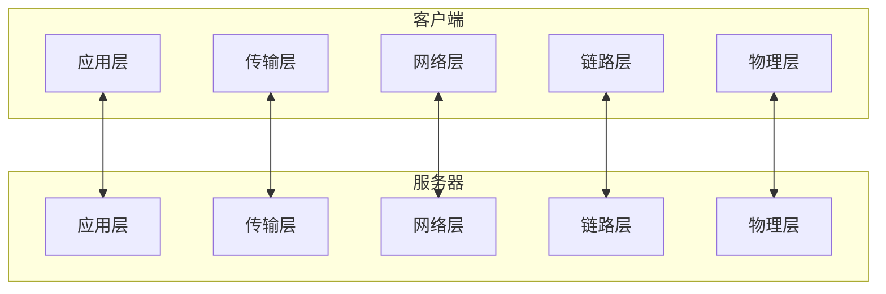
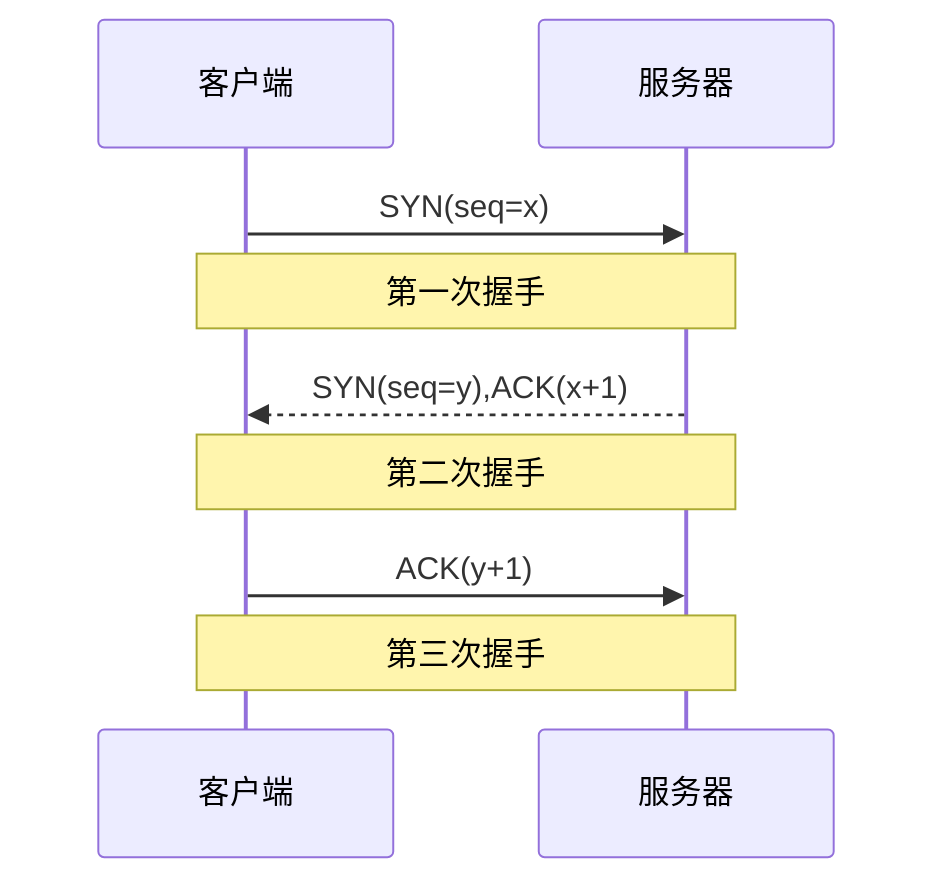
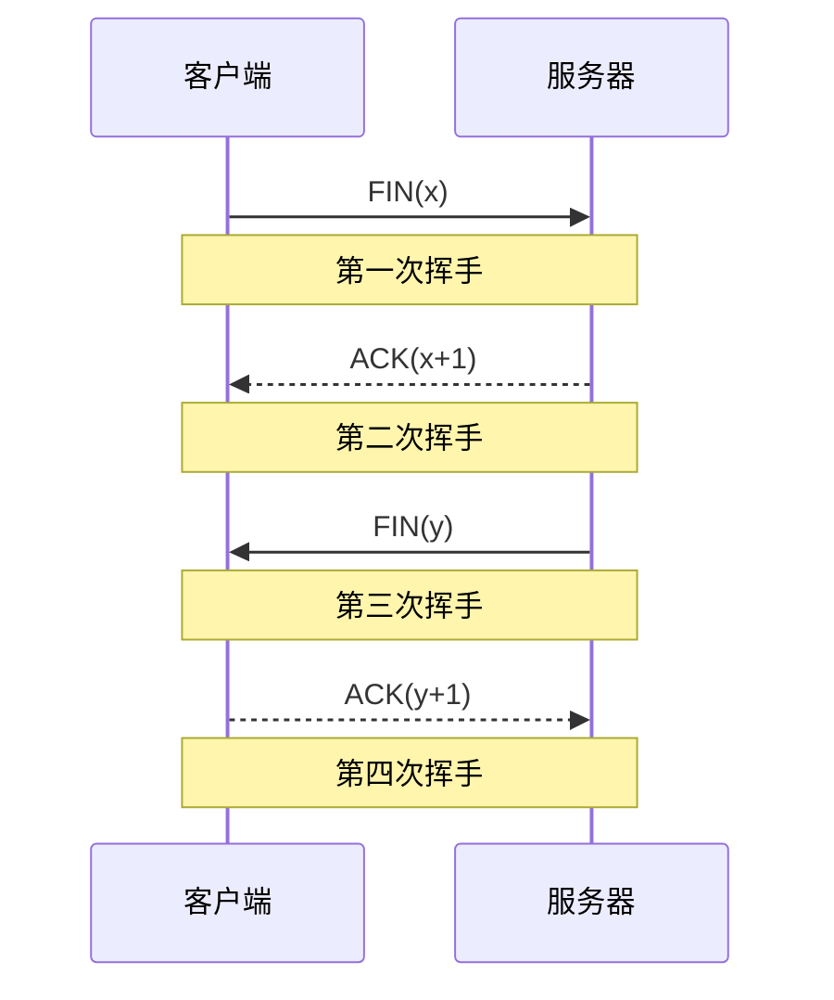
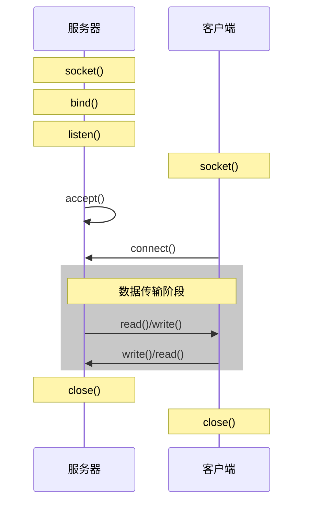

# 网络编程基础

## TCP协议

### TCP通信概览


### 三次握手


三次握手的过程:
1. 客户端发送 SYN 包(seq=x)到服务器,请求建立连接
2. 服务器收到 SYN 包,回复 SYN+ACK 包(seq=y,ack=x+1)
3. 客户端收到 SYN+ACK 包,回复 ACK 包(ack=y+1)

### 四次挥手


四次挥手的过程:
1. 客户端发送 FIN 包,请求关闭连接
2. 服务器收到 FIN 包,回复 ACK 包
3. 服务器发送 FIN 包,请求关闭连接
4. 客户端收到 FIN 包,回复 ACK 包

### 重要问题解答

#### 为什么连接是三次握手,关闭是四次挥手?
因为建立连接时,服务器收到 SYN 后可以把 ACK 和 SYN 放在一个包中发送。但关闭连接时,服务器收到 FIN 后,可能还有数据需要发送,所以先回复 ACK,等数据发送完后再发送 FIN。

#### 为什么需要 TIME_WAIT 状态?
1. 确保最后一个 ACK 能到达服务器。如果这个 ACK 丢失,服务器会重发 FIN 包
2. 等待老的数据包在网络中自然消失,避免与新连接混淆

TIME_WAIT 持续时间是 2MSL(Maximum Segment Lifetime),即两倍的最大报文段生存时间。

## Socket 编程

### Socket通信流程


### 基本概念
Socket 是应用层与 TCP/IP 协议族通信的中间软件抽象层,表现为一个文件描述符。

### 服务器端步骤

1. 创建 Socket
```cpp
int sockfd = socket(AF_INET, SOCK_STREAM, 0);
```

2. 绑定地址和端口
```cpp
struct sockaddr_in server_addr;
server_addr.sin_family = AF_INET;
server_addr.sin_port = htons(PORT);
server_addr.sin_addr.s_addr = htonl(INADDR_ANY);
bind(sockfd, (struct sockaddr*)&server_addr, sizeof(server_addr));
```

3. 监听连接
```cpp
listen(sockfd, BACKLOG);
```

4. 接受连接
```cpp
struct sockaddr_in client_addr;
socklen_t client_len = sizeof(client_addr);
int connfd = accept(sockfd, (struct sockaddr*)&client_addr, &client_len);
```

5. 数据收发
```cpp
char buffer[1024];
recv(connfd, buffer, sizeof(buffer), 0);
send(connfd, buffer, strlen(buffer), 0);
```

### 客户端步骤

1. 创建 Socket
```cpp
int sockfd = socket(AF_INET, SOCK_STREAM, 0);
```

2. 连接服务器
```cpp
struct sockaddr_in server_addr;
server_addr.sin_family = AF_INET;
server_addr.sin_port = htons(PORT);
inet_pton(AF_INET, SERVER_IP, &server_addr.sin_addr);
connect(sockfd, (struct sockaddr*)&server_addr, sizeof(server_addr));
```

3. 数据收发
```cpp
char buffer[1024];
send(sockfd, buffer, strlen(buffer), 0);
recv(sockfd, buffer, sizeof(buffer), 0);
```

### Socket API 详解

#### socket()
```cpp
int socket(int domain, int type, int protocol);
```

参数说明:
- domain: 协议族
  - AF_INET: IPv4
  - AF_INET6: IPv6
- type: 套接字类型
  - SOCK_STREAM: TCP
  - SOCK_DGRAM: UDP
- protocol: 协议
  - 0: 自动选择
  - IPPROTO_TCP: TCP
  - IPPROTO_UDP: UDP

#### bind()
```cpp
int bind(int sockfd, const struct sockaddr *addr, socklen_t addrlen);
```

将 socket 与特定的 IP 地址和端口绑定。

#### listen()
```cpp
int listen(int sockfd, int backlog);
```

将 socket 设置为监听状态,backlog 指定连接队列的最大长度。

#### accept()
```cpp
int accept(int sockfd, struct sockaddr *addr, socklen_t *addrlen);
```

从已完成连接队列中获取一个连接。

### 注意事项

1. 字节序转换
- htons(): 主机序转网络序(short)
- htonl(): 主机序转网络序(long)
- ntohs(): 网络序转主机序(short)
- ntohl(): 网络序转主机序(long)

2. 地址转换
```cpp
// 字符串IP转网络字节序
inet_pton(AF_INET, "192.168.1.1", &addr.sin_addr);

// 网络字节序转字符串IP
char ip[INET_ADDRSTRLEN];
inet_ntop(AF_INET, &addr.sin_addr, ip, sizeof(ip));
```

3. 错误处理
```cpp
if (sockfd < 0) {
    perror("socket error");
    exit(1);
}
```

## 最佳实践

### 服务器设计建议

1. 使用非阻塞 IO 或多线程处理多个客户端
2. 合理设置 backlog 大小
3. 处理 SIGPIPE 信号
4. 及时关闭不用的连接
5. 使用 SO_REUSEADDR 选项

### 客户端设计建议

1. 实现断线重连机制
2. 设置合适的超时时间
3. 处理网络异常情况
4. 数据校验和重传机制

### 调试技巧

1. 使用 tcpdump 抓包分析
2. netstat 查看连接状态
3. lsof 查看文件描述符
4. strace 跟踪系统调用

## 参考资料

- [TCP三次握手和四次挥手详解](https://blog.csdn.net/whuslei/article/details/6667471)
- [Socket编程步骤详解](https://www.cnblogs.com/Sniper-quay/archive/2011/06/22/2086636.html)
- [socket函数详解](https://www.cnblogs.com/zhangyabin---acm/p/3198363.html)
- [listen函数详解](https://www.cnblogs.com/still-smile/p/13611270.html) 